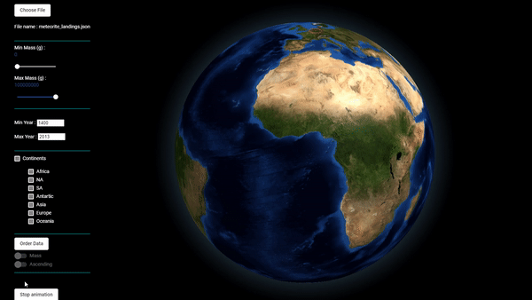

# Meteorite Landings

Meteorite Landings website designed to respond to a practical course during our Master's degree.
Thanks to @Fyleek & @CostaIsNotAvailable to work on this project !

## Tech Stack

backend:
- [.NET 5.0](https://dotnet.microsoft.com/en-us/)
- [Json.NET](https://www.newtonsoft.com/json) (JSON reader/writter)
- [YamlDotNet](https://github.com/aaubry/YamlDotNet/) (YAML reader/writter)

frontend:
- [Angular](https://angular.io/) /Typescript (Framework)
- [Bootstrap](https://getbootstrap.com/) (Styling)
- [ThreeJS](https://threejs.org/) (Color system)

## Getting Started

Make sure you have Node.js v12.20.0+ installed on your machine.
Make sure you use [Visual Studio](https://visualstudio.microsoft.com/en-us/downloads/) to launch the backend.
Make sur you install Check that you use DotNet [SDK 5.0](https://dotnet.microsoft.com/en-us/download/dotnet/5.0)

1. **Open Project**: Open projet with `.sln` file
2. **Install Dependencies**: In terminal type :`cd /MeteoriteLandings/ClientApp && npm install`
5. **Start your app**: Select `MeteoLandings` then launch it !
6. **Use the app**: When your browser is open, select the file to import the data :`meteorite_landings.json` wich is in your main project folder

## Settings

Before launching the apocalypse you can filter the meteorites according to:
- Minimum Mass (0g to 100000000g) **Range**
- Maximum Mass (0g to 100000000g) **Range**
- Minimum Year (1400th to 2011th) **Range**
- Maximum Year (1400th to 2011th) **Range**
- Continents **Checkbox**
    - Africa
    - NA
    - SA
    - Antartic
    - Asia
    - Europe
    - Oceania
- Order data by their Mass or their Date **Slider**
- Order data by Ascending or Descending **Slider**

##### Then ******PRESS LAUNCH****** ! or you can skip animation 🤫

## Enjoy !
You can now see the meteorites crashing on our beautiful planet with their names and locations.

Thank you for installing our study project !